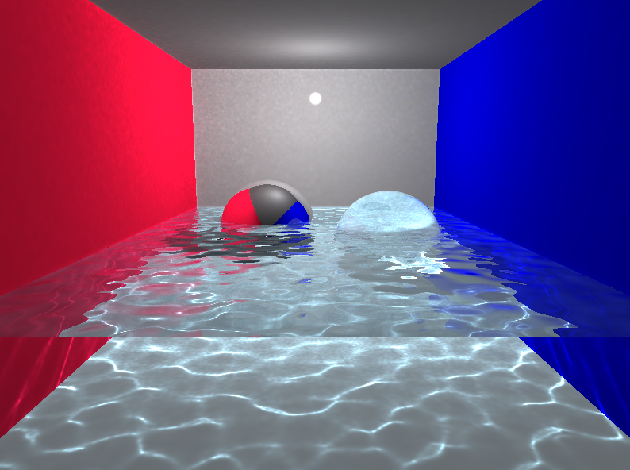
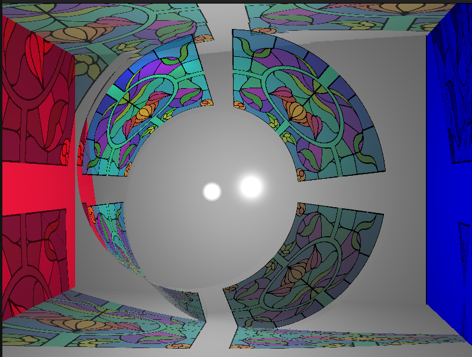
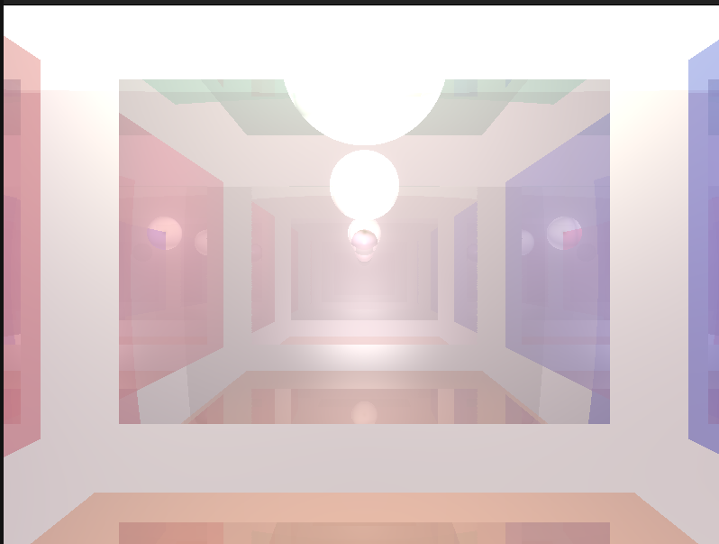
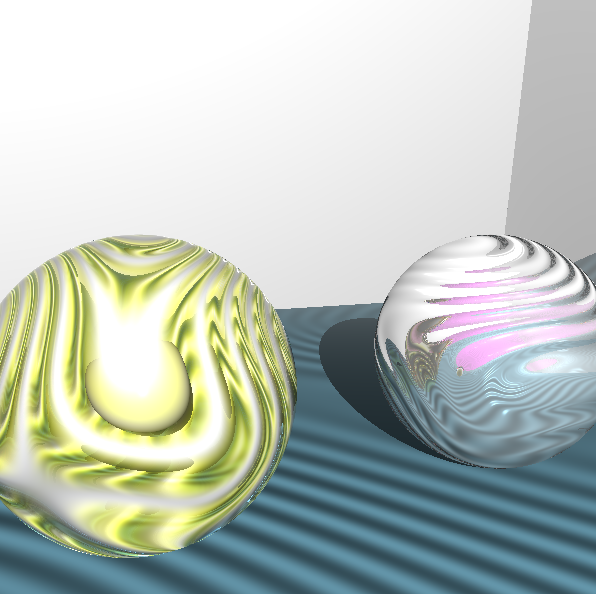
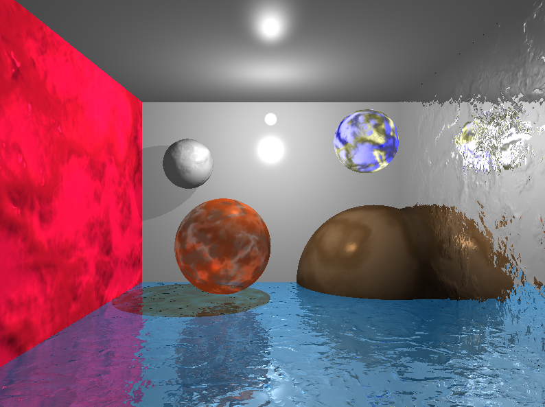
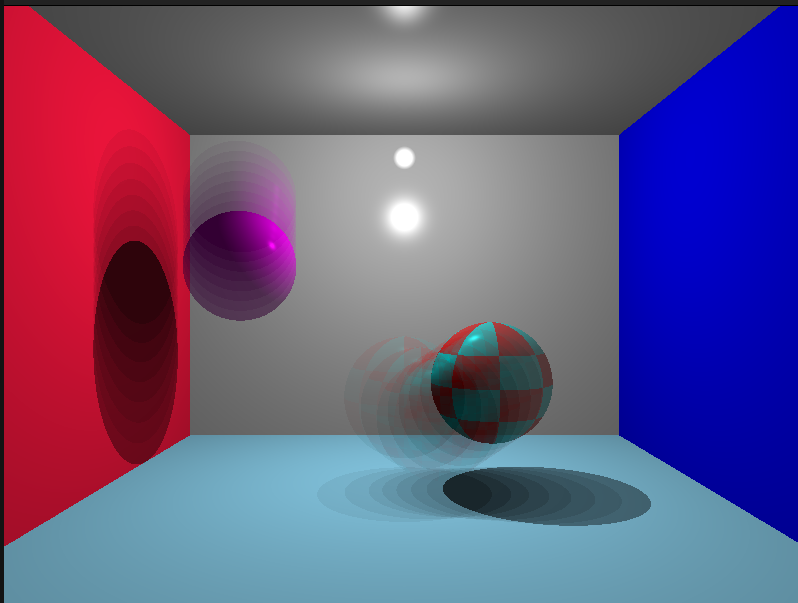

# RT

RT is a project of school 42

## Build Instructions

To build the project, run the following command:

```sh
make
```

This will compile the source files and generate the executable named `rt`.

## Usage

To run the RT demos, use the `demo.sh` script with one or more of the following categories:

- shape
- light
- texture
- cutting
- negative
- ray_effect
- other
- all

Example usage:

```sh
./demo.sh shape light
```

This will run the shape and light demos. To run all demos, use:

```sh
./demo.sh all
```

## Cleaning Up

To clean the build files, run:

```sh
make clean
```

To remove all build files and the executable, run:

```sh
make fclean
```

To rebuild the project from scratch, run:

```sh
make re
```

## Screenshots








